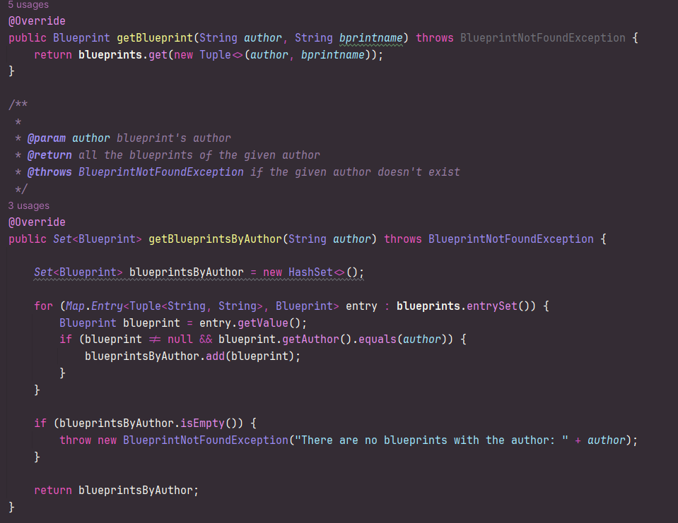
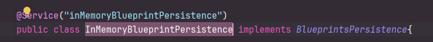
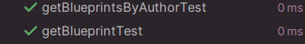
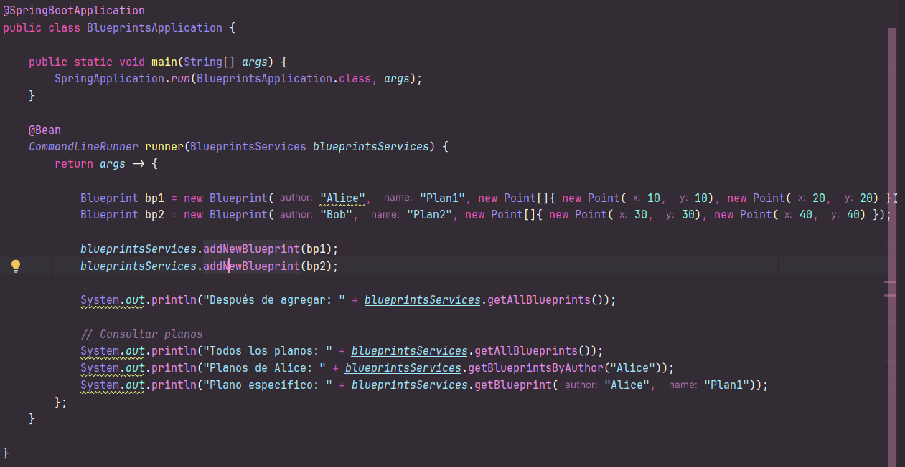
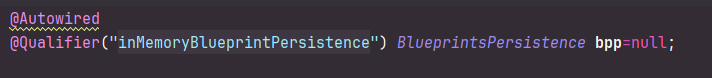
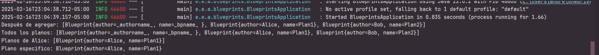

# Componentes y conectores - Parte I

### Andrea Valentina Torres Tobar
### Andres Serrato Camero

## Ejercico introductorio

El ejercicio se encuentra en el archivo EjercicioIntroductorio.zip

## Blueprint

Se implementaron los metodos vacios en todas las clases que eran necesarios para su ejecución, como:

Además, se implementó la clase InMemoryBlueprintPersistence para que se acople al diagrama de clases planteado en el ejercicio.

Finalmente, se implementaron las pruebas unitarias para cada uno de los métodos de las clases, con el fin de verificar su correcto funcionamiento.

Por otro lado, para qué se puede ejecutar mediante Spring, se creó una instancia de BlueprintServices, rectificando funcionalidades de registrar planos, consultar planos, registrar planos específicos.

Además de eso, para que no hubiera conflicto en las inyecciones, se colocó @Qualifier, para que se pueda inyectar la clase InMemoryBlueprintPersistence.

Dando como resultado:

